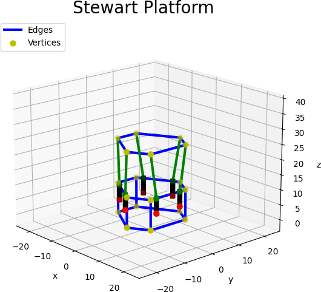
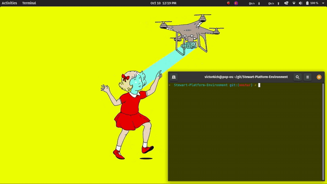

<h1 align="center">Stewart Plataform Environment</h1>
<h3 align="center">Environment with 6 actuators made in matplotlib for the development of algorithms for the stewart platform.</h3>

<p align="center">
  
  
  
</p>
<br/>

## Environment
<p align="justify">
  
  <a>This project is intended to provide a simulation environment for performing virtual tests for a stewart platform. It consists of a board with 6 actuators working in parallel, so it is possible to use this environment as a basis for testing your parallel kinematics algorithms.</a>
</p>

## Setup
<p align="justify">
 <a>All of requirements is show in the badgets above, but if you want to install all of them, enter the repository and execute the following line of code:</a>
</p>

```shell
pip3 install -r requirements.txt
```

<p align="justify">
 <a>To execute the test code just use:</a>
</p>

```shell
python3 test.py
```

## Objectives
<p align="justify">
  <a>To use this environment in the best possible way I strongly recommend looking at the test code provided in the test.py file. Anyway, this code can be seen right below:</a>
</p>

```shell
import stewart
import threading

# Create the environment object
env = stewart.environment()

def code():
    ''' Your main code here
    ''' 
    # This function send the angles to servo motors
    angles = [90,90,90,90,90,90]
    env.step(angles, 0.1, 100)

# Create the threading for main code running
code_thread = threading.Thread(name = 'Code', target = code)
code_thread.setDaemon(True)
code_thread.start()
# Call for show plot on environment, it has to be at the end of the code
env.showPlot()
```

<p align="center">
  
</p>

<p align="center">
  <i>If you liked this repository, please don't forget to starred it!</i>
  
</p>
